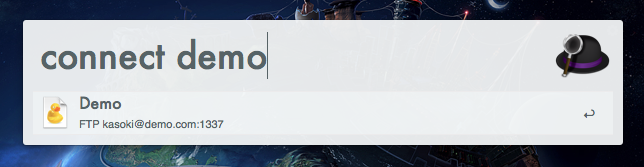
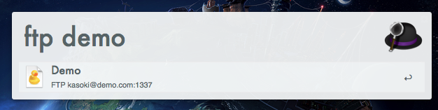

Cyberduck favorites
====================

This is an [Alfred workflow](http://alfredapp.com) which allows you to open your bookmarks/favorites from alfred.

This workflow is based on [alfred.py](https://github.com/Kasoki/alfred.py)

Licence
--------

This workflow is licenced under the terms of the [MIT Licence](http://opensource.org/licenses/MIT)